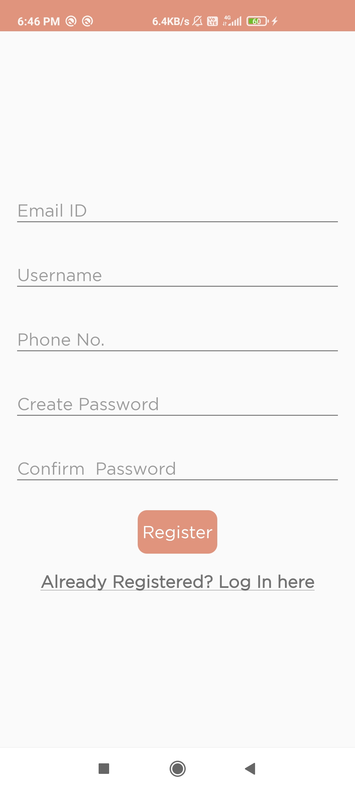
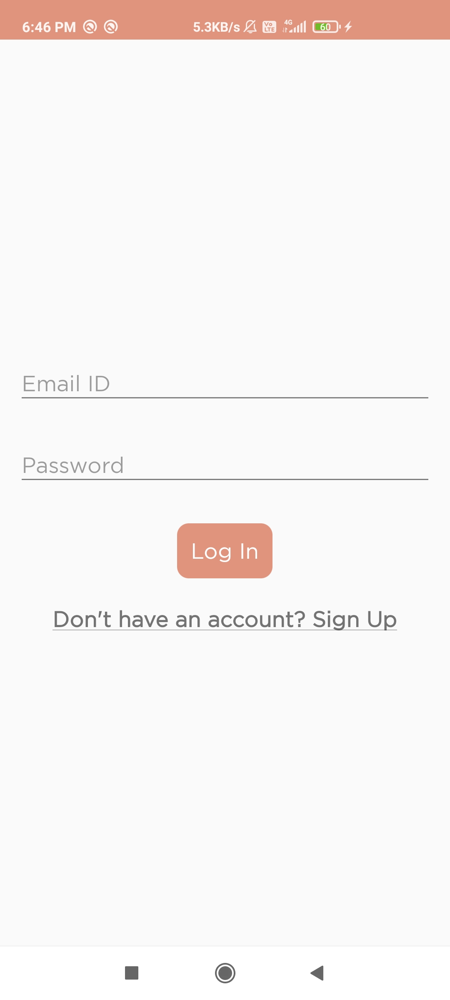
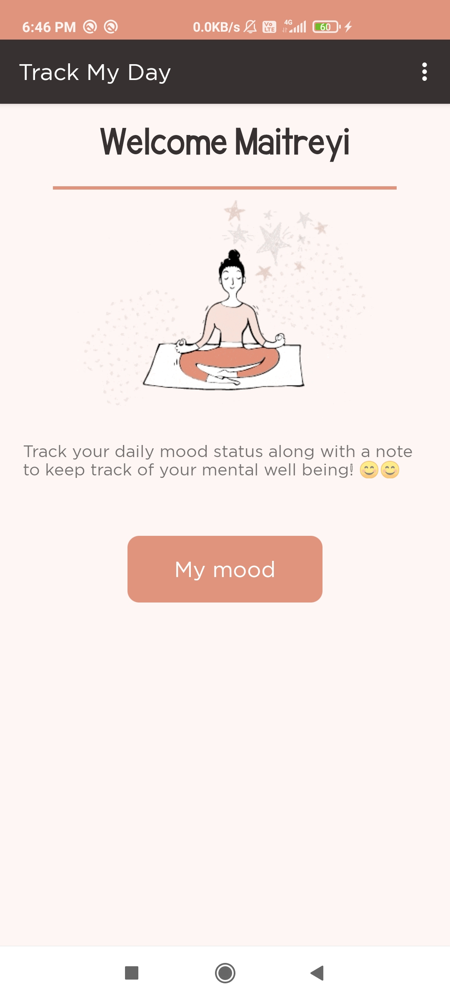
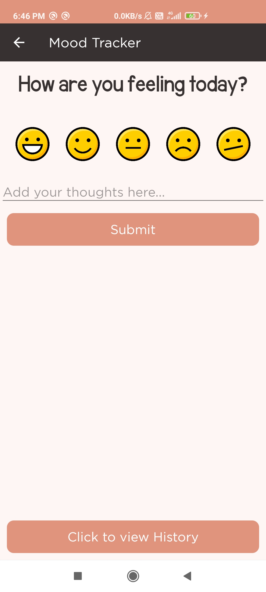
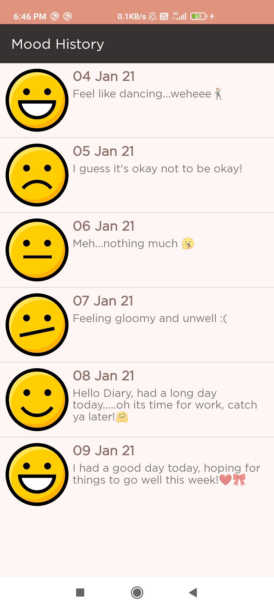

# About the app
Track My Day is a simple Android application that allows users to keep track of their daily mood alongwith a daily note.
# Features
<ul>
<li>User can register themselves by providing email, phone, name password.</li> 
<li>User can perform log in and log out once registered.</li>
<li>Once logged in, user can enter their mood for  the day and also submit an optional note.</li>
<li>They can also view a list of their entire mood history in the form of a list.</li>
</ul>

# Screenshots

## Registration and sign up
       

## Home Page

## Mood Tracker
       

# Tech Stack
## Java
The application's user interface and backend is designed and developed in Java for Android.
## Firebase
Google Firebase has been used since it provides out-of-the-box authentication and storage of user data.

# How to use
<ul>
<li>Clone/download the project in Android Studio</li> 
<li>Create your own firebase project from the firebase console ( https://firebase.google.com/ )</li>
<li>Replace the ./app/google-services.json file with your just created firebase project's google-services.json file.</li>
<li>Run the app!</li>
</ul>
    
    
Thanks for  reading, I hope this helps someone out there starting with App Development 😊
